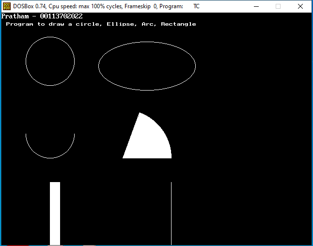

# 🎨 Computer Graphics

Welcome to my repository of Computer Graphics programs, featuring various classic graphics algorithms and visual outputs. Each program is carefully implemented and accompanied by its output image for easy reference.

---

## Contents

- **[Q2](#Q2)** - WAP to display a Circle, Ellipse, Arc, and Rectangle

---

### Q2 - Displaying a Circle, Ellipse, Arc, and Rectangle

**Description**:  
A program that demonstrates basic geometric shapes—circle, ellipse, arc, and rectangle—rendered using standard Computer Graphics functions.

**Output**:  

---

More programs coming soon!
